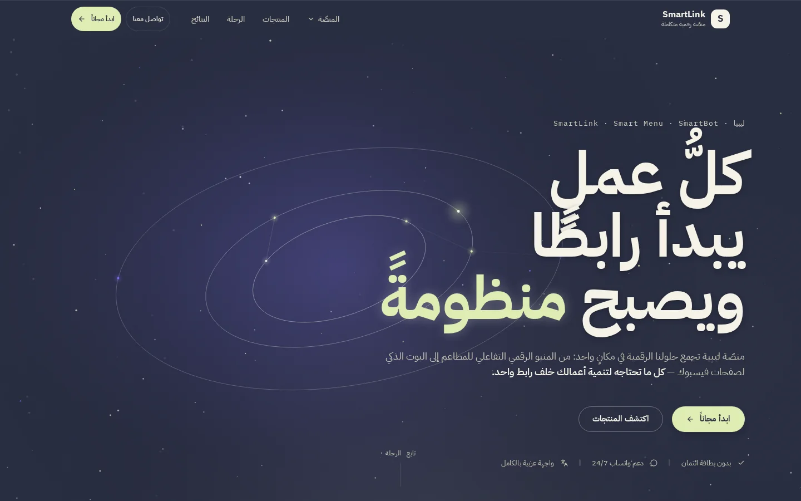
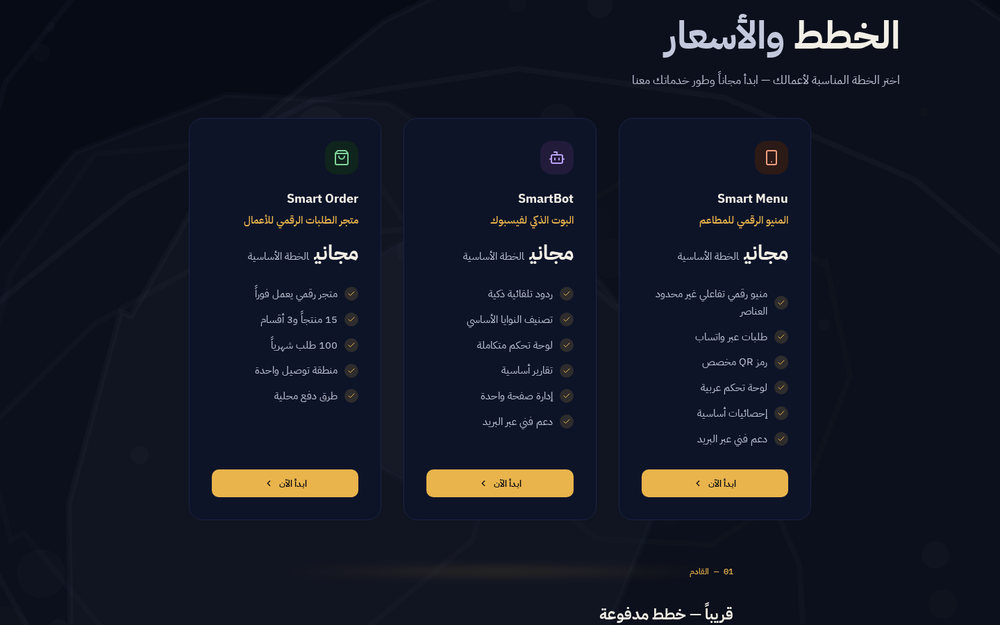
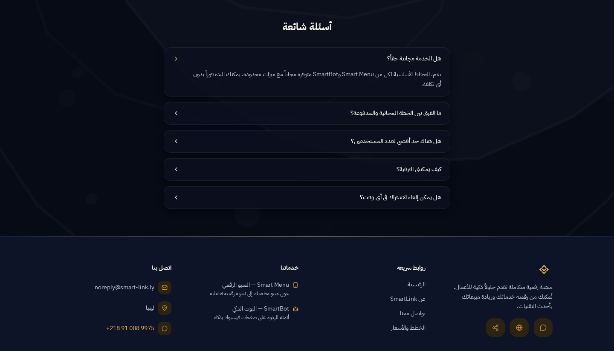

# سمارت لينك — SmartLink

> **SmartLink** — the digital umbrella for businesses in Libya: the agency site and the front door of the Smart ecosystem — services, pricing, FAQ and contact, all under one link.

> 🌐 **العربية** · [English](./README.en.md)

[](https://github.com/ahmadmedo1012/Smart-Link/actions/workflows/ci.yml)
[](https://smart-link.ly)
[](./LICENSE)

**الموقع المباشر:** <https://smart-link.ly> · **الدعم:** واتساب 24/7



## ما هذا المشروع؟

**سمارت لينك هو المظلة الرقمية للأعمال في ليبيا** — واجهة الوكالة وبوابة المنظومة في آنٍ واحد:

- **موقع الوكالة**: يعرّف بالخدمات ويعرض منتجي المنظومة الحاليين — [Smart Menu](https://menu.smart-link.ly) (المنيو الرقمي وطلبات واتساب) و[SmartBot](https://bot.smart-link.ly) (بوت وأتمتة لصفحات فيسبوك) — مع رحلة هبوط كاملة من العنوان حتى النداء الختامي.
- **بيت المنظومة**: نقطة البداية الرسمية لعائلة مشاريع سمارت الأوسع (سمارت أوردر، مدارك) — انظر [التذييل العائلي](#-جزء-من-منظومة-مدارك--part-of-the-madarek-ecosystem) أسفل الصفحة.
- **قناة التحول**: خطط وأسعار واضحة، أسئلة شائعة، ونموذج تواصل يصل فعلًا — مع دعم واتساب 24/7.

الموقع عربي أولًا (RTL بالكامل)، يعمل بثيم داكن/فاتح، ومبني ليكون سريعًا ومتاحًا منذ أول طلب.

## المزايا

### الصفحات والأقسام

- **رحلة هبوط كاملة بأسلوب Orbit-Ink**: سماء المدار (محرك **OrbitScene** حقيقي على canvas — نجوم ومدارات حية، لا صورة ثابتة)، شريط منتجات متحرك بحلقة RTL سلسة (42 ثانية)، شريط أرقام الثقة بعدّادات تتحرك عند الظهور (+500 عميل نشط، +10K منيو رقمي، +50K رد آلي، جهوزية 99.9%)، مدارات المنتجات، رحلة الربط بخمس محطات ومسار ضوء، قصة التقدّم، عالم المنصّات، الأدوار، ونداء ختامي.
- **ست صفحات داخلية**: عن الوكالة · الخطط والأسعار · تواصل معنا · الخصوصية · الشروط · صفحة Offline — إضافة إلى صفحات 404/خطأ مخصصة.
- **استجابة كاملة** من 320px حتى الشاشات العريضة، بأهداف لمس لا تقل عن 44px.

### الخطط والأسعار

- بطاقتا خطة — **Smart Menu** و**SmartBot** — بالخطة الأساسية المجانية، مع قائمة ميزات كل منتج وأسعار بأرقام جدولية (tnum) وروابط مباشرة للبدء.
- شارة «الخطط المدفوعة قريبًا» لمسار الترقية القادم.

### الأسئلة الشائعة

- **أكورديون متاح** (ARIA كامل: فتح/إغلاق بلوحة المفاتيح، حالة `aria-expanded`، محتوى غير مقصوص) في الصفحة الرئيسية وصفحة الأسعار.
- بيانات **FAQPage** منظمة (JSON-LD) للأهلية لنتائج Google الغنية.

### التواصل والتحول

- **نموذج تواصل يصل فعلًا**: تحقق مزدوج (HTML ثم API)، تنضيد XSS، مصيدة honeypot، وحد معدل — ثم إرسال عبر Resend بقالبي react-email (إشعار للمالك + تأكيد للمرسل).
- **فشل صريح لا نجاح وهميًا**: بدون مفتاح الإرسال يعيد المسار 503 مع بدائل واتساب — الرسالة لا تختفي بصمت أبدًا.
- أزرار واتساب مباشرة (دعم 24/7) وروابط ذهبية مغناطيسية نحو المنتجات.

### اللغة والمظهر والأداء

- **عربي/RTL أولًا**: واجهة عربية كاملة الاتجاه، مع تنسيق صحيح لأرقام الهواتف داخل `dir="ltr"` (لا انقلاب bidi).
- **ثيم داكن/فاتح**: مبدّل next-themes مثبَّت بعد التحميل — بلا وميض، واحترام كامل لـ `prefers-color-scheme` و`prefers-reduced-motion`.
- **PWA**: صفحة Offline خاصة + service worker + manifest قابل للتثبيت.
- **سرعة بلا تنازلات**: كل الصفحات Server Components والتفاعل في جزر عميلة صغيرة فقط، خطوط مُستضافة ذاتيًا، وحركة CSS خالصة — **بلا أي مكتبة حركة**.

## لقطات الشاشة



*صفحة الخطط والأسعار: بطاقتا المنتجين مع ميزات كل خطة وزر البدء المباشر.*



*أكورديون الأسئلة الشائعة (سؤال مفتوح) وتذييل الموقع بروابطه وقنوات التواصل.*

> التسميات الكاملة والمصادر في [docs/screenshots/CAPTIONS.md](docs/screenshots/CAPTIONS.md).

## التقنيات

- **Next.js 16** (App Router) — كل الصفحات Server Components، التفاعل في جزر عميلة صغيرة فقط.
- **Tailwind CSS v4** عبر `@theme` — جسر توكنات **مدارك** (Madarek) في الوضعين: ليلي night/gold ‎`#070B16`/`#E9B44C`‎ ونهاري cream/copper ‎`#FBFAF9`/`#B57438`‎ (تباين AA)، تسع عائلات باستيل × {bg, ink, deep}، سلّما أنصاف 6–28 وحركة 80–720ms.
- **خط IBM Plex Sans Arabic** 400–700 مُستضاف ذاتيًا (`public/fonts/` — ملفات woff2 للسانس العربي ar+la والمونو اللاتيني) — بلا أي طلب خط خارجي.
- **TypeScript** صارم (يُتحقق منه في البناء).
- **Resend + react-email** للإرسال البريدي، **next-themes** للمظهر، **Playwright + axe-core** للاختبارات.
- **حركة CSS خالصة** — `animation-timeline`/keyframes مع حماية `prefers-reduced-motion`؛ لا framer-motion ولا أي مكتبة حركة.

## البدء السريع

المتطلبات: **Node 22+** و**npm 11**.

```bash
npm install
cp .env.example .env.local   # اختياري في التطوير (انظر الجدول)
npm run dev                  # http://localhost:3000
```

| المتغير | الحاجة | الوصف |
|---|---|---|
| `RESEND_API_KEY` | للإرسال الفعلي | مفتاح [Resend](https://resend.com/api-keys) — بدونه يفشل نموذج التواصل بصوت عالٍ (503) ولا يعرض نجاحًا وهميًا |

للاختبارات الشاملة (على بناء إنتاجي):

```bash
npx playwright install chromium   # مرة واحدة
npm run build && npm run test:e2e
```

## الأوامر

| الأمر | الوصف |
|---|---|
| `npm run dev` | خادم التطوير |
| `npm run build` | بناء إنتاجي (يشغّل فحص TypeScript تلقائيًا) |
| `npm run start` | تشغيل البناء الإنتاجي محليًا |
| `npm run lint` | ESLint — صفر أخطاء مطلوب |
| `npm run test:parity` | لقطة تكافؤ توكنات مدارك (node صِرف — تُفرض في CI) |
| `npm run test:e2e` | الجناح الكامل: build ← `next start` ← Playwright + axe-core |
| `npm run test:live:sim` | محاكاة على الموقع الحي smart-link.ly (إعداد Playwright منفصل) |

## هيكل المستودع

```
src/
├── app/               # الصفحات + مسارات API (App Router)
│   ├── page.tsx         # الرئيسية — رحلة الهبوط الكاملة (مكون خادم)
│   ├── about/ pricing/ contact/ privacy/ terms/ offline/
│   ├── api/contact/     # POST — تحقق + honeypot + حد معدل + Resend
│   ├── sitemap.ts robots.ts   # ديناميكية (lastmod عند كل نشر)
│   ├── error.tsx global-error.tsx not-found.tsx
│   └── layout.tsx       # الخطوط + JSON-LD + metadata الجذر
├── components/        # الجزر العميلة (OrbitScene، النموذج، الأكورديون…) ومكونات الخادم
├── emails/            # قوالب react-email للإشعار والتأكيد
└── lib/               # site.ts (مصدر الحقيقة الوحيد للأرقام والروابط) + seo.ts + schema.ts
e2e/                  # جناح E2E — 23 ملف مواصفات (Playwright + axe-core)
tests/parity.mjs      # لقطة تكافؤ توكنات مدارك (node صِرف)
docs/                 # التقارير + لقطات الشاشة
public/               # الخطوط المستضافة ذاتيًا + الأيقونات + sw.js + manifest
.github/workflows/ci.yml   # CI: lint ← parity ← build ← e2e على كل دفعة إلى main
```

## الأمان والجودة (مدمجة في البناء)

- ترويسات أمنية كاملة في `next.config.ts`: HSTS، CSP، X-Frame-Options، Referrer-Policy، Permissions-Policy — مثبتة بفحص حي في الجناح.
- تحقق إدخال + تنضيد XSS + honeypot + حد معدل في مسار التواصل.
- `npm audit`: صفر ثغرات في تبعيات الإنتاج.
- Lighthouse: a11y/best-practices/SEO = 100 في كل الصفحات — القياسات موثقة في [docs/lighthouse-baseline.md](docs/lighthouse-baseline.md).
- SEO كامل: metadata وcanonical وog/twitter لكل صفحة + بيانات JSON-LD منظمة (Organization / WebSite / FAQPage / BreadcrumbList) + sitemap وrobots ديناميكيان.

## الاختبارات

جناح E2E داخل المستودع — **23 ملف مواصفات** تحت `e2e/`، يُشغّل على بناء إنتاجي (`next start`) عبر Playwright + axe-core، إلى جانب **لقطة تكافؤ توكنات مدارك** تُفرض في CI (يكبر العدد كل جولة — انظر [CHANGELOG.md](CHANGELOG.md)):

- **الدخان**: الصفحات + 404 (200/RTL/h1/عنوان/صفر أخطاء console) وعدّادات الإحصائيات.
- **السلوك**: القائمة الجوالة، المنسدلة، مبدّل الثيم، زر العودة للأعلى، اللمس والأجهزة (320px فأعلى).
- **SEO والبيانات المنظمة**: canonical وog/twitter وrobots وsitemap وmanifest، ومحتوى JSON-LD الحقيقي من DOM.
- **الأمان**: كل الترويسات حية + تخزين immutable للأصول + لا X-Powered-By.
- **الأكورديون والنموذج**: فتح/إغلاق + aria + الإجابة غير مقصوصة؛ عقد API كاملة (400/honeypot/503/429) ومسار الخطأ ببدائل واتساب.
- **axe-core**: صفر انتهاكات WCAG 2 AA في الوضعين الداكن والفاتح — الفحص بحالة `prefers-reduced-motion` لثبات النتائج بلا flake، مع بقاء أي انتهاك حقيقي مرئيًا.

## الوثائق

- [CHANGELOG.md](CHANGELOG.md) — موجز كل موجة تغييرات (يتحدث كل جولة)
- [SECURITY.md](SECURITY.md) — نطاق الدعم وقنوات الإبلاغ عن الثغرات
- [CONTRIBUTING.md](CONTRIBUTING.md) — بيوت الجودة وقواعد الالتزام والمساهمة
- [docs/smartlink-final-report.md](docs/smartlink-final-report.md) — التقرير الأم لكل جولات التحسين
- [docs/projects-comparison.md](docs/projects-comparison.md) — المقارنة المباشرة بين منتجات المنظومة
- [docs/lighthouse-baseline.md](docs/lighthouse-baseline.md) — خط أساس الأداء عبر الجولات
- [docs/screenshots/CAPTIONS.md](docs/screenshots/CAPTIONS.md) — تسميات لقطات الشاشة ومصادرها
- `CLAUDE.md` — قواعد العمارة لكل مساعد ذكاء اصطناعي يعمل على المستودع

## النشر

تلقائي عبر تكامل GitHub ← Vercel (مشروع `smartlink`). كل دفعة إلى `main` تنشر وتحدّث sitemap lastmod — والتحقق بعد النشر جزء من الثقافة: لا يُغلق بند إلا بدليل حي من الرابط المباشر.

---

## 🛰️ جزء من منظومة مدارك — Part of the Madarek Ecosystem

> نظام تصميم واحد لكل المشاريع · هوية مدارك: ليلي night/gold `#070B16`/`#E9B44C` — نهاري cream/copper `#FBFAF9`/`#B57438` — خط IBM Plex Sans Arabic

| المشروع | الدور | GitHub | الموقع المباشر |
|---|---|---|---|
| 🎓 **مدارك / Madarek** | منصة التعليم الذكي لجامعة الزاوية — المرجع الأم لنظام التصميم | [github.com/ahmadmedo1012/madarek](https://github.com/ahmadmedo1012/madarek) | [madarek.onrender.com](https://madarek.onrender.com) |
| 🔗 **سمارت لينك / Smart-Link** | المظلة الرقمية للأعمال في ليبيا | [github.com/ahmadmedo1012/Smart-Link](https://github.com/ahmadmedo1012/Smart-Link) | [smart-link.ly](https://smart-link.ly) |
| 🍽️ **سمارت منيو / Smart-Menu** | منيو رقمي وطلبات واتساب للمطاعم | [github.com/ahmadmedo1012/Smart-Menu](https://github.com/ahmadmedo1012/Smart-Menu) | [menu.smart-link.ly](https://menu.smart-link.ly) |
| 🤖 **سمارت بوت / SmartBot** | بوت ماسنجر وأتمتة لصفحات فيسبوك | [github.com/ahmadmedo1012/SmartBot](https://github.com/ahmadmedo1012/SmartBot) | [bot.smart-link.ly](https://bot.smart-link.ly) |
| 🛍️ **سمارت أوردر / Smart-Order** | متجر رقمي وطلبات وتوصيل للأعمال | [github.com/ahmadmedo1012/Smart-Order](https://github.com/ahmadmedo1012/Smart-Order) | [order.smart-link.ly](https://order.smart-link.ly) |

## الرخصة

هذا المشروع **برنامج احتكاري (Proprietary)** — جميع الحقوق محفوظة © 2026 أحمد مدو (ahmadmedo1012). لا يمنح استعراض المستودع أو استنساخه أي حق في الاستخدام أو النسخ أو التعديل أو النشر أو إعادة التوزيع دون إذن كتابي مسبق من مالك الحقوق.

النص القانوني الكامل في [LICENSE](./LICENSE) — للاستفسارات التجارية: [ahmadmedo1012@gmail.com](mailto:ahmadmedo1012@gmail.com).
